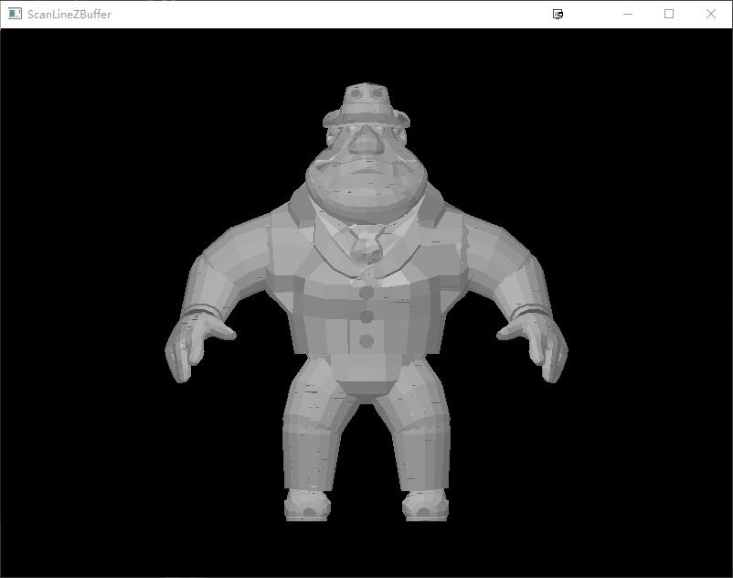
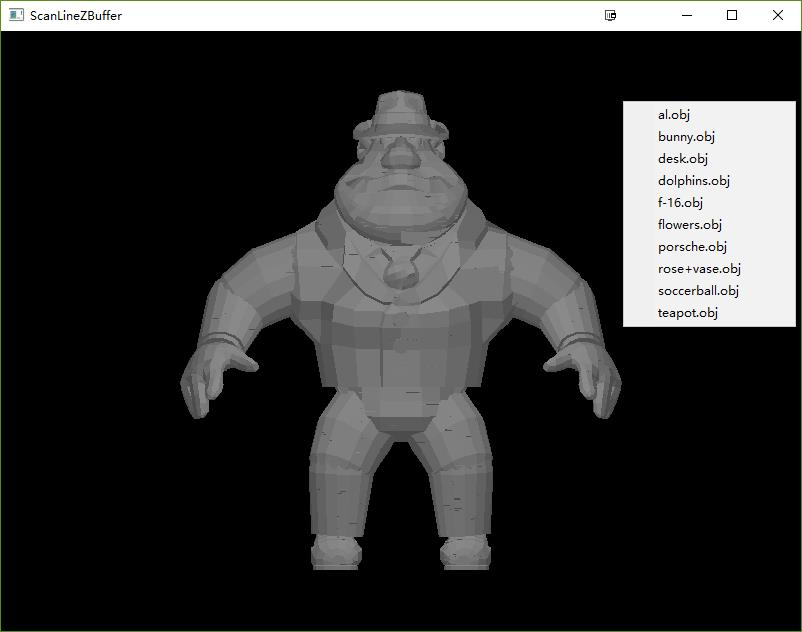
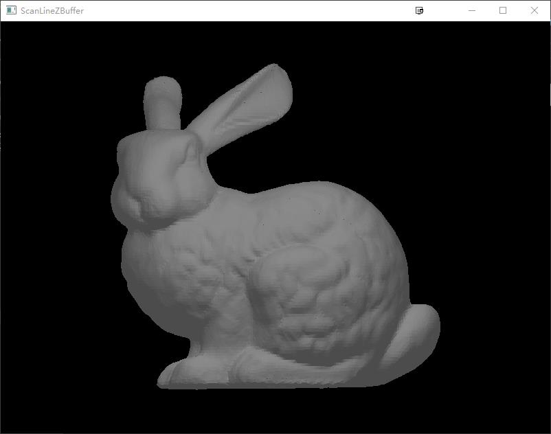
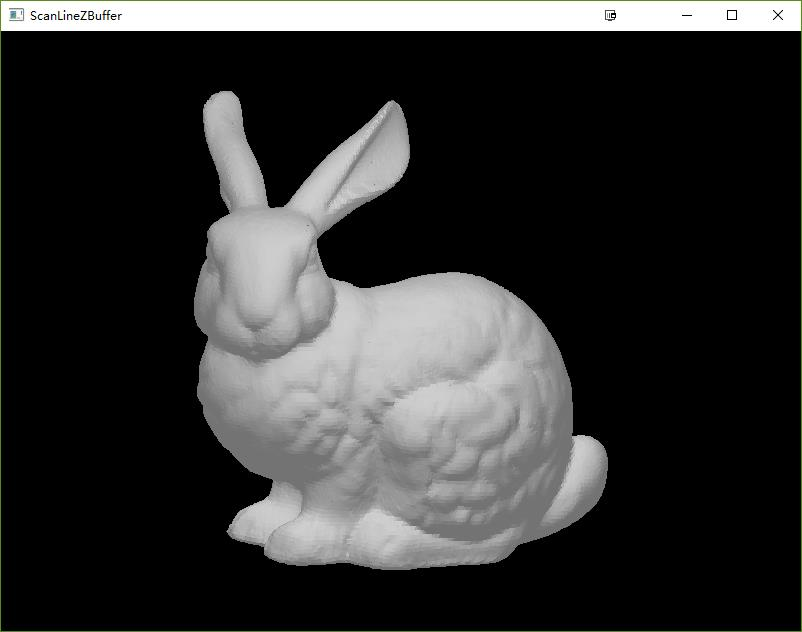
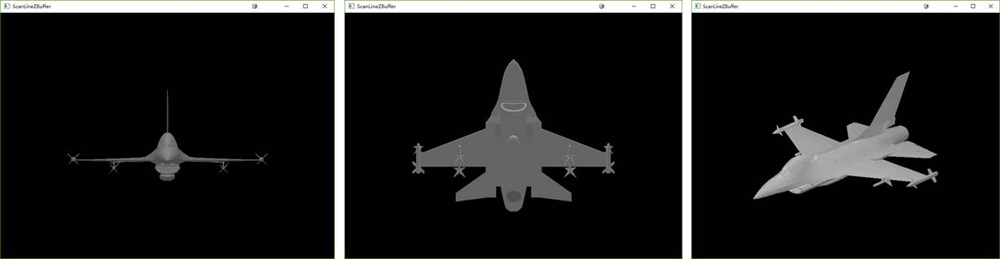
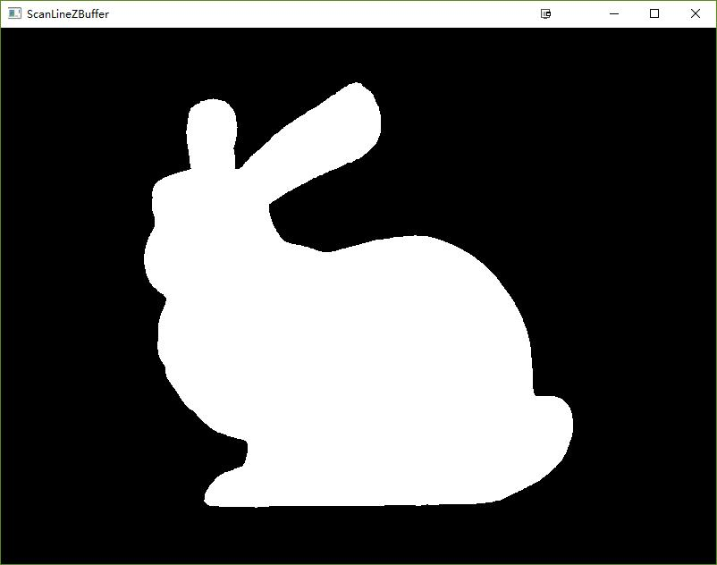

## 内容及要求

- 编程实现扫描线z缓冲器算法(不能调用已有的z缓冲器算法API函数)；
- 编程语言及环境：C、C++、Java等，最好是常见的开发环境，以利于作业检查，如MS Visual Studio；
- 场景实现：可以导入场景，如OBJ、3DS等。也可自己编程实现简单的建模功能(可以得高分)；
- 评价指标：面片不少于1000个；应当含非凸多面体；算法效率；是否有加速等，综合考虑。

## 开发环境
- 操作系统：Win10 x64
- 计算机配置：Intel i7-6700 CPU(3.4GHz)，内存：DDR4 8G
- IDE: Microsoft Visual Studio 2013 x86
- 依赖库：GLUT(用于用户界面设计)
- 说明：只配置了VS2013 x86工程，GLUT在x64工程中存在问题，因此没有配置

## 软件使用说明

### 程序启动
运行Win32 Release工程(双击Release目录下的ScanLineZBuffer.exe)，程序启动，默认加载解决方案下models路径中的al.obj模型文件，并使用扫描线Z-Buffer算法对所加载模型进行绘制，其结果如图1所示。并在命令窗口中输出模型加载、绘制所消耗的时间，所加载模型的面片数量和顶点数量。

<b>图1</b> al.obj模型的绘制结果

### 模型加载

如果需要加载其他模型，可以将需要加载的模型的obj文件放置到models路径下，并且在窗口中右击，窗口会弹出菜单，如图2所示。

<b>图2</b> 模型选择菜单栏

菜单中出现的选项为models路径下的obj文件。左击菜单中，对应的菜单项即可加载对应的obj模型。例如，点击bunny.obj菜单项，即可加载bunny.obj模型，得到结果如图3所示。

<b>图3</b> bunny.obj模型的绘制结果

### 模型的伸缩旋转

点击窗口右上方的放大按钮，窗口适应屏幕的大小，所绘制的模型也相应的增大。在窗口为屏幕大小的情况下，点击窗口右上方的缩小按钮，窗口缩小到原来的默认大小(800×600)。在窗口的缩放过程中，模型都需要进行重新绘制。

本程序支持鼠标拖动旋转和键盘按键旋转。鼠标拖动旋转可以比较灵活的旋转模型，同时键盘按键旋转可以实现比较精准的旋转。这里对键盘按键旋转功能进行详细说明。键盘上对应快捷键的功能：

- “↑”：绕x轴顺时针方向转动30度；
- “↓”: 绕x轴逆时针方向转动30度；
- “←”: 绕y轴顺时针方向转动30度;
- “→”: 绕y轴逆时针方向转动30度;
- “Page Up”: 绕z轴顺时针方向转动30度;
- “Page Down”: 绕z轴逆时针方向转动30度;

说明：鼠标拖动转动和键盘按键转动的转动轴都是通过对应模型的中心点的。

通过旋转，用户可以根据需要，拖动三维模型或者键盘按钮来查看三维模型的不同部分，实现了三维模型的完全可视化。例如，转动图3中bunny模型，可以得到如图4的结果。

<b>图4</b> bunny 转动结果

f-16.obj模型的转动结果如图5所示。

<b>图5</b> f-16模型的旋转结果

### 模型着色

为了使程序绘制得到的模型具有一定的三维感，程序中增加了简单的点光源着色。在窗口大小为800×600的情况下，点光源位于窗口上方中间的前面（屏幕外面），以窗口左下角为坐标原点(0,0,0)，光源的位置为(400,600,500)，这样刚好能够照亮模型的正面。如图6所示为未使用点光源着色的bunny模型，与图3中使用点光源着色的bunny模型对比，明显未使用点光源着色的bunny模型完全没有三维层次感，无法验证扫描线Z-Buffer算法是否正确处理了遮挡关系。

<b>图6</b> 未使用点光源着色的bunny模型

### 软件特点

- 支持通过菜单进行模型加载；
- 支持凸多边形面元模型的绘制；
- 支持模型的缩放；
- 支持通过鼠标、键盘转动模型，查看更方便；
- 支持简单的点光源进行着色，具有良好的三维层次感。

---

## 数据结构说明

为了使得程序具有良好的层次性，采用了C++面向对象的编程。程序根据不同阶段的需求，设计了如下类，并对其需要完成的功能和特点进行了说明：

- Vec类：主要用于表达颜色、位置等三维向量数据；
- Model类：主要用于加载obj文件中的模型，其成员包括模型顶点、模型面、面法线等；
- Rasterizer类：根据窗口的大小，对Model模型进行光栅化，并且使得模型位于窗口的中间位置；
- Shader类：根据光源的位置、定点的位置和面元的法线方向，结合光线颜色和环境颜色，对对应面元进行着色，使得模型具有亮块和阴影，更加具有三维层次感；
- ScanLineZBuffer类：实现扫描线Z-Buffer算法，记录窗口对应位置需要进行绘制的面元的ID(idBUffer)。其具体数据结构包括；
    - polygonTable：多边形表，其类型为vector<list<Polygon>>，窗口的每一行（扫描线）所包含的多边形，每一行可以包括在这一行的多个多边形，并组成一张链表(list)。另外，本算法支持的多边形不局限与三角形，可以支持任意类型的凸多边形；
    - edgeTable：分类边表，其类型为vector<list<Polygon>>，窗口的每一行（扫描线）所包含的边，记录了上端点的坐标，所属多边形的ID，边直线的负斜率倒数和跨越扫描线的条数；
    - activePolygonTable：活化多边形表，每个活化多边形又包含了对应的活化边表。主要用于记录当前扫描线对应的多边形(活化多边形)和对应多边形的边(活化边)，根据扫描线的移动而改变。需要注意的是：这里的活化边表与课件中的有所不同。这里的活化边没有按照边对来进行组织，而是按照扫描线所在位置来选择对应的边对。这样减少了一条活化边结束切换到另外一条开始的活化边对当前活化多边形是否结束的判断，减少了开销，并使得算法框架统一高效。
- Display类：主要用于交互界面和模型的显示，将扫描线Z-Buffer算法得到的idBUffer结合相应ID的面元进行着色，并显示到窗口中。另外，提供了第3节中的用户界面交互功能。
---

## 加速说明

扫描线Z-Buffer算法本身充分利用了多边形区域、扫描线和边的连贯性，避免了大量的反复求交，消影的效率较高。在这个基础上，本文将活化边表不保存为一对，而是分别保存，这样避免了大量对当前活化多边形是否结束的判断，提高了程序的运行效率。

同时，扫描线Z-Buffer算法具有一定的平行性，在分类多边形表和分类边表的构建、扫描线填充的过程中都具有良好的并行性。因此，利用OpenMP可以有效地对扫描线Z-Buffer具有良好的加速作用，充分利用了计算机的CPU资源。另外在模型旋转的过程中，模型各个点的旋转相互独立，也可以利用OpenMP进行并行加速。

---

## 性能表现

在配置为主频 3.4GHz 的Intel i7-6700 CPU，内存为DDR4 8G的台式机上，本文程序的表现如下所示：

<b>表1</b> 模型加载绘制耗时

|       模型       |  顶点数  |  面元数  | 加载耗时/ms | 绘制耗时/ms |
| :------------: | :---: | :---: | :-----: | :-----: |
|     **Al**     | 3618  | 3340  |   249   |   25    |
|   **Bunny**    | 34834 | 69451 |  10822  |   426   |
|    **Desk**    | 2296  | 2438  |   196   |   12    |
|  **Dolphins**  |  855  | 1692  |   64    |   17    |
|    **F-16**    | 2344  | 2366  |   189   |   18    |
|  **Flowers**   | 7608  | 4061  |   591   |   41    |
|  **Porsche**   | 4099  | 4740  |   398   |   36    |
| **Rose+Vase**  | 2184  | 3360  |   230   |   27    |
| **Soccerball** | 1760  | 1992  |   131   |   20    |
|   **Teapot**   |  530  |  992  |   38    |   10    |

从表1中可以看出，本程序可以满足一般模型(顶点数和面元数较少)的查看。对于较复杂的模型，如Bunny模型的加载速度较慢，大概需要10秒，但是绘制的速度还行，大概需要0.5秒。同样，在其他模型中，模型的加载时间远长于模型绘制所消耗的时间，因此如何加载模型算法的加速是提高程序性能的突破口。程序较快的绘制速度可以有效地满足一个模型的旋转查看。 

